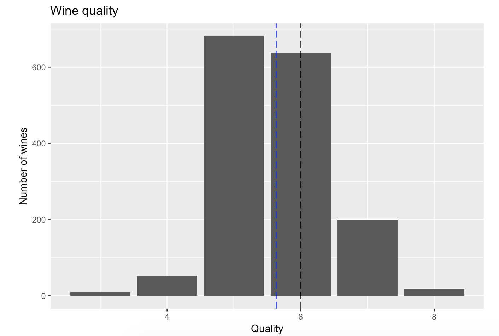
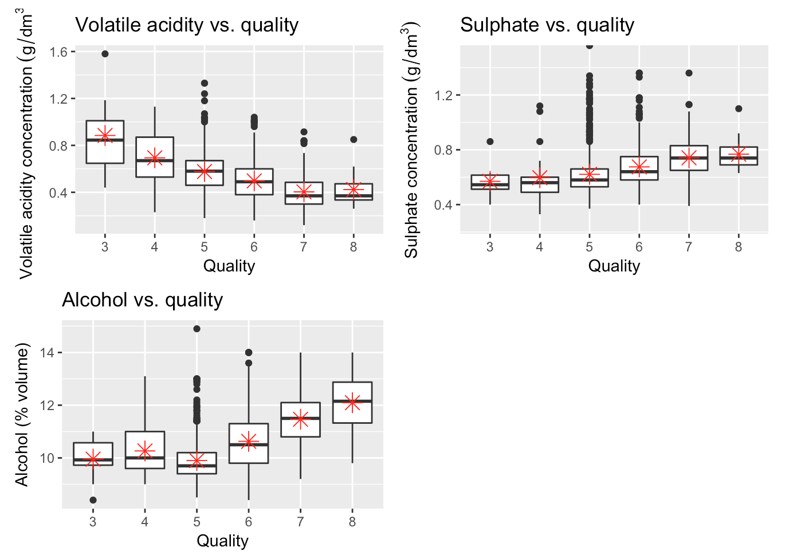
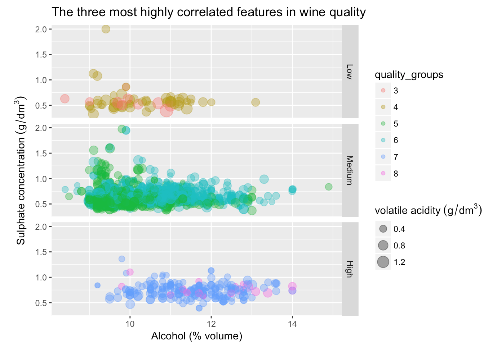

# EDA_project
## This project aims to explore the factors that contribute to the quality of a wine.
The dataset used for this project is public available for research. The details
are described in [Cortez et al., 2009].

P. Cortez, A. Cerdeira, F. Almeida, T. Matos and J. Reis. Modeling wine
preferences by data mining from physicochemical properties. In Decision Support
Systems, Elsevier, 47(4):547-553. ISSN: 0167-9236.

### Brief overview of the data set
The majority of wines (roughly 82%) have a quality between of 5 or 6. There are very few low and high quality wines and absolutely none
with a quality of 1,2,8 or 9. Due to the limited amount of data we have on wines that are not of an average quality it will be difficult
to determine what produces a high quality wine using this data alone.

### Largest contributing factors to wine quality
Three factors that were highly correlated with quality were alcohol, sulphate levels and volatile acid. The high quality wines were shown
to contain a low amount of volatile acidity and higher amounts of alcohol and sulphates. The lower quality wines displayed high amount
of volatile acidity and low amounts of alcohol and sulphates. Therefore theese attributes can be used to make a reasonable prediction of
how a wines quality will be scored.

### The three most highlt corrleated features of wine
The plots show that low quality wines tend to have a higher volatile acidity and lower sulphate and alcohol levels, while high quality
wines display the opposite. The average quality wines suffer from quite a lot of overplotting  which is due to the bulk of the data
representing average quality wines. It is interesting to note that there is plenty of overlap for these three features for all of the
different wine qualities. Since there is no distinctive barrier between the differing qualities other fcators must be taken into
consideration when assesing a wines quality.
One distinctive pattern that can be seen is that the majority of the high quality wines have much lower levels of volatile acidity than the
low quality wines. Despite the fact that high quality wines can still be found to have a lower alcohol percentage, which is commonly found
in lower quality wines, it seems unlikely that you will find a high quality wine that will have a high volatile acidity. The maximum amount
of volatile acidity found in high quality wines is 0.915g/dm^3 whereas in low quality wines it can be as high as 1.58g/dm^3. However, these
values are outliers as the mean volatil acidity for low and high quality wine is 0.72 and 0.4 respectively.

